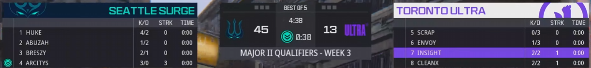
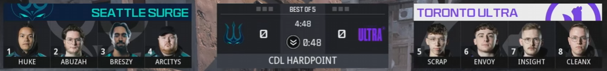
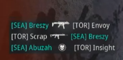

# 🏗️ 🚧 UNDER CONSTRUCTION 🚧 🏗️

# CDL Live Stat Tracker (Work In Progress)

This project is dedicated to providing real-time statistics for Call of Duty League (CDL) games. CDL is the esports platform for Call of Duty. 

During CDL games, a stat board occasionally appears, displaying the current stats for the players. However, most of the time, the screen only shows the players' faces. This project aims to fill that gap by tracking these stats live during the matches.

*Example of a stat board during a CDL game*

*Typical view during a CDL game*

## How It Will Work

The primary statistic this program tracks is the kills and deaths for each player (K/D). All kills players achieve are displayed in the killfeed during the match as the player scores the kills. 

The program watches the screen and uses Optical Character Recognition (OCR) to identify which player has made a kill and who that player killed. It then updates this information live.

  
*Example of a killfeed during a CDL game*
